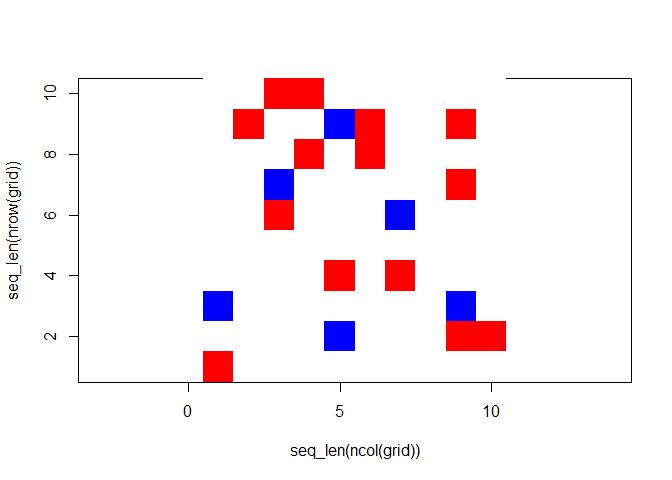
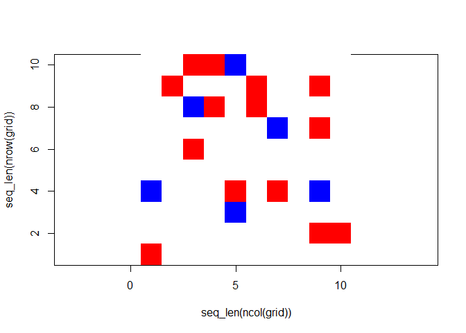
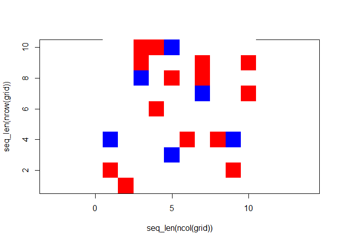
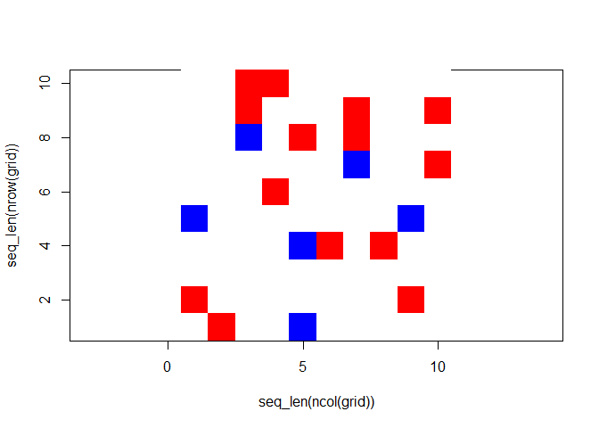
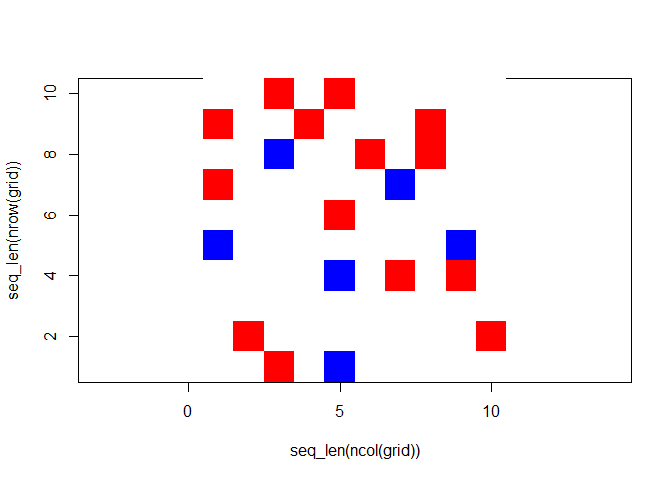
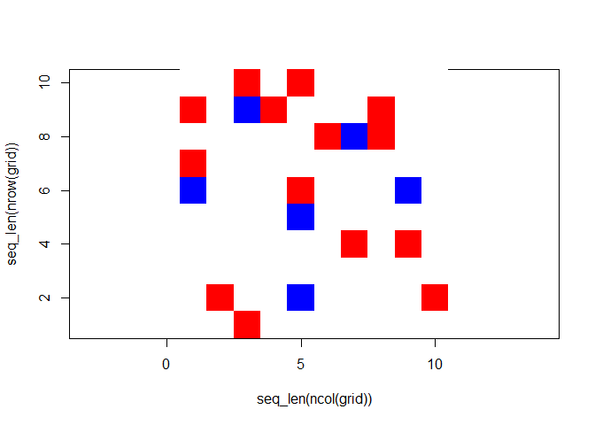

<!-- README.md is generated from README.Rmd. Please edit that file -->

# carsimr.Thota

<!-- badges: start -->

[](https://github.com/saichan0529/carsimr.Thota/actions/workflows/R-CMD-check.yaml)
<!-- badges: end -->

The carsimr.Thota package simulates the movement of blue and red cars on
a grid. Cars are randomly distributed based on a specified proportion or
number. In each trial, blue cars move upwards while red cars move to the
right, alternating between trails. The movement continues in a circular
order.

## Installation

You can install the development version of carsimr.Thota from
[GitHub](https://github.com/) with:

``` r
# install.packages("devtools")
devtools::install_github("saichan0529/carsimr.Thota")
```

## Example

This is a basic example which shows you how to solve a common problem:

``` r
library(carsimr.Thota)
## basic example code
```

What is special about using `README.Rmd` instead of just `README.md`?
You can include R chunks like so:

Initialize a Grid: To initialize a grid with a specified proportion of
blue cars and move them, you can use the initialize_grid function.
Here’s an example:

Initialize a grid with 20% of cars (rho = 0.2) with 50% probability of
blue cars, prob_blue = 0.5 and dimensions 10x10

``` r
grid <- initialize_grid(rho = 0.2, dims = c(10, 10), prob_blue = 0.5)
```

Print the initialized grid

``` r
grid
#> $grid
#>       [,1] [,2] [,3] [,4] [,5] [,6] [,7] [,8] [,9] [,10]
#>  [1,]    0    0    2    2    0    0    0    0    0     0
#>  [2,]    0    2    0    0    1    2    0    0    2     0
#>  [3,]    0    0    0    2    0    2    0    0    0     0
#>  [4,]    0    0    1    0    0    0    0    0    2     0
#>  [5,]    0    0    2    0    0    0    1    0    0     0
#>  [6,]    0    0    0    0    0    0    0    0    0     0
#>  [7,]    0    0    0    0    2    0    2    0    0     0
#>  [8,]    1    0    0    0    0    0    0    0    1     0
#>  [9,]    0    0    0    0    1    0    0    0    2     2
#> [10,]    2    0    0    0    0    0    0    0    0     0
#> 
#> attr(,"class")
#> [1] "carsimr"
```

Move Cars: To move the cars on the grid, you can use the move_cars
function. Here’s an example:

``` r
moved_grid <- move_cars(grid, trials = 5)
```

Print the moved grid

``` r
moved_grid
#> $grids
#> $grids[[1]]
#> $grid
#>       [,1] [,2] [,3] [,4] [,5] [,6] [,7] [,8] [,9] [,10]
#>  [1,]    0    0    2    2    0    0    0    0    0     0
#>  [2,]    0    2    0    0    1    2    0    0    2     0
#>  [3,]    0    0    0    2    0    2    0    0    0     0
#>  [4,]    0    0    1    0    0    0    0    0    2     0
#>  [5,]    0    0    2    0    0    0    1    0    0     0
#>  [6,]    0    0    0    0    0    0    0    0    0     0
#>  [7,]    0    0    0    0    2    0    2    0    0     0
#>  [8,]    1    0    0    0    0    0    0    0    1     0
#>  [9,]    0    0    0    0    1    0    0    0    2     2
#> [10,]    2    0    0    0    0    0    0    0    0     0
#> 
#> attr(,"class")
#> [1] "carsimr"
#> 
#> $grids[[2]]
#> $grid
#>       [,1] [,2] [,3] [,4] [,5] [,6] [,7] [,8] [,9] [,10]
#>  [1,]    0    0    2    2    1    0    0    0    0     0
#>  [2,]    0    2    0    0    0    2    0    0    2     0
#>  [3,]    0    0    1    2    0    2    0    0    0     0
#>  [4,]    0    0    0    0    0    0    1    0    2     0
#>  [5,]    0    0    2    0    0    0    0    0    0     0
#>  [6,]    0    0    0    0    0    0    0    0    0     0
#>  [7,]    1    0    0    0    2    0    2    0    1     0
#>  [8,]    0    0    0    0    1    0    0    0    0     0
#>  [9,]    0    0    0    0    0    0    0    0    2     2
#> [10,]    2    0    0    0    0    0    0    0    0     0
#> 
#> attr(,"class")
#> [1] "carsimr"
#> 
#> $grids[[3]]
#> $grid
#>       [,1] [,2] [,3] [,4] [,5] [,6] [,7] [,8] [,9] [,10]
#>  [1,]    0    0    2    2    1    0    0    0    0     0
#>  [2,]    0    0    2    0    0    0    2    0    0     2
#>  [3,]    0    0    1    0    2    0    2    0    0     0
#>  [4,]    0    0    0    0    0    0    1    0    0     2
#>  [5,]    0    0    0    2    0    0    0    0    0     0
#>  [6,]    0    0    0    0    0    0    0    0    0     0
#>  [7,]    1    0    0    0    0    2    0    2    1     0
#>  [8,]    0    0    0    0    1    0    0    0    0     0
#>  [9,]    2    0    0    0    0    0    0    0    2     0
#> [10,]    0    2    0    0    0    0    0    0    0     0
#> 
#> attr(,"class")
#> [1] "carsimr"
#> 
#> $grids[[4]]
#> $grid
#>       [,1] [,2] [,3] [,4] [,5] [,6] [,7] [,8] [,9] [,10]
#>  [1,]    0    0    2    2    0    0    0    0    0     0
#>  [2,]    0    0    2    0    0    0    2    0    0     2
#>  [3,]    0    0    1    0    2    0    2    0    0     0
#>  [4,]    0    0    0    0    0    0    1    0    0     2
#>  [5,]    0    0    0    2    0    0    0    0    0     0
#>  [6,]    1    0    0    0    0    0    0    0    1     0
#>  [7,]    0    0    0    0    1    2    0    2    0     0
#>  [8,]    0    0    0    0    0    0    0    0    0     0
#>  [9,]    2    0    0    0    0    0    0    0    2     0
#> [10,]    0    2    0    0    1    0    0    0    0     0
#> 
#> attr(,"class")
#> [1] "carsimr"
#> 
#> $grids[[5]]
#> $grid
#>       [,1] [,2] [,3] [,4] [,5] [,6] [,7] [,8] [,9] [,10]
#>  [1,]    0    0    2    0    2    0    0    0    0     0
#>  [2,]    2    0    0    2    0    0    0    2    0     0
#>  [3,]    0    0    1    0    0    2    0    2    0     0
#>  [4,]    2    0    0    0    0    0    1    0    0     0
#>  [5,]    0    0    0    0    2    0    0    0    0     0
#>  [6,]    1    0    0    0    0    0    0    0    1     0
#>  [7,]    0    0    0    0    1    0    2    0    2     0
#>  [8,]    0    0    0    0    0    0    0    0    0     0
#>  [9,]    0    2    0    0    0    0    0    0    0     2
#> [10,]    0    0    2    0    1    0    0    0    0     0
#> 
#> attr(,"class")
#> [1] "carsimr"
#> 
#> $grids[[6]]
#> $grid
#>       [,1] [,2] [,3] [,4] [,5] [,6] [,7] [,8] [,9] [,10]
#>  [1,]    0    0    2    0    2    0    0    0    0     0
#>  [2,]    2    0    1    2    0    0    0    2    0     0
#>  [3,]    0    0    0    0    0    2    1    2    0     0
#>  [4,]    2    0    0    0    0    0    0    0    0     0
#>  [5,]    1    0    0    0    2    0    0    0    1     0
#>  [6,]    0    0    0    0    1    0    0    0    0     0
#>  [7,]    0    0    0    0    0    0    2    0    2     0
#>  [8,]    0    0    0    0    0    0    0    0    0     0
#>  [9,]    0    2    0    0    1    0    0    0    0     2
#> [10,]    0    0    2    0    0    0    0    0    0     0
#> 
#> attr(,"class")
#> [1] "carsimr"
#> 
#> 
#> attr(,"class")
#> [1] "carsimr_list"
```

Plot Cars: You can visualize the cars on the grid using the plot
function.

``` r
plot(moved_grid, pause = .9)
```


